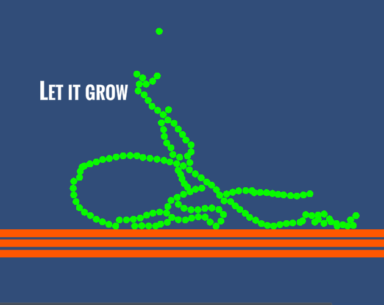

# Let it grow
[Rigid Jam #2](https://itch.io/jam/rigidjam2)  
Theme: Grow  
**Let it grow** - 2d physics-based game, where you need to build really high plant

# Downloads and Links
Available in [Windows, OSX and Linux](https://itch.io/jam/rigidjam). If you encounter any problem, please leave a issue! 

# How to play
Move mouse to move active part. Collide with already placed parts to attach it. New part will spawn above previous.

# What is Rigid Jam?
Just a short jam, which increased in length each time(1, 2, 3... hours), hosted by [member](https://discordapp.com/invite/2vkeudT) of [TriJam](https://discordapp.com/invite/DScpGwU) community
